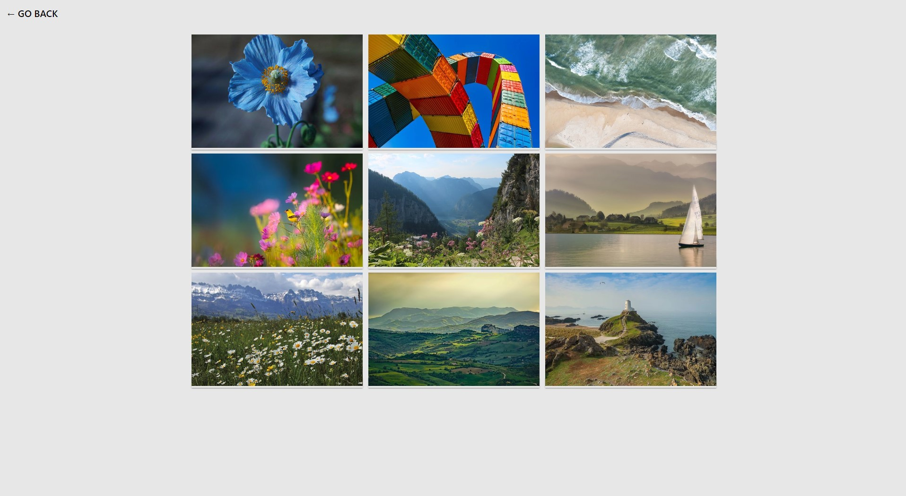

# IMAGE GALLERY

#### 1. A gallery has been created with the ability to click on its elements and view a full-sized image in a modal window.

#### 2. Created and rendered markup based on the gallery items data array and provided gallery element template.

#### 3. The script and styles of the basicLightbox modal window library are connected.

#### 4. Opening a modal window by clicking on a gallery element.

#### 5. Changed the value of the src attribute of the  element in the modal window before opening.

# IMAGE GALLERY WITH SIMPLELIGHTBOX LIBRARY

#### 1. The same gallery is made, but the SimpleLightbox library is used, which will take care of processing clicks on images, opening and closing a modal window, and scrolling through images using the keyboard.

#### Adaptive design to mobile, table, desktop.

